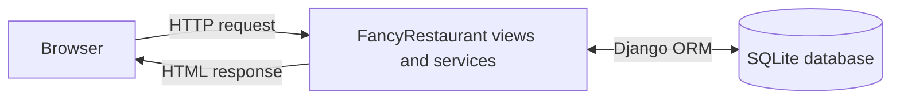

# Fancy Restaurant Reservation System

## Project Outline

Fancy Restaurant Reservation System is a web application that allows users to reserve a table at a restaurant.

Users can enter the number of guests, choose a desired date and time slot, and confirm a reservation. The system assigns a suitable available table based on the number of guests. If no table is available for the selected time slot, the system suggests another nearby time slot or another nearby date.

## Main User Actions

- The user can log in or enter their name.
- The user enters the number of guests.
- The user chooses a desired date from the calendar.
- The user chooses a desired time slot.
- The user confirms the booking with an OK button.
- The user can register as a user and log in.

## Main Data Entities

- Customer
- Table
- Reservation
- Time Slot

## Basic Data Model Idea

- Customers store a name, unique login name, and password hash. Registered customers can authenticate with their login name and password.
- Tables have a table number and seating capacity.
- Time slots represent reusable reservation start times.
- Reservations connect one customer, reservation date, time slot, guest count, and assigned table.

The system should choose the smallest available table that can fit the number of guests.

Later exercises will add complete availability validation, cancellation handling, and nearby-slot suggestions.

## Initial Database Schema

The `reservations` app defines these Django models:

- `Customer`: the restaurant application's customer record, corresponding to `Patient` in the instructor's Dentistry example.
- `Table`: restaurant table records with a number and seating capacity.
- `TimeSlot`: reusable reservation start times such as `18:00` or `19:30`.
- `Reservation`: date-specific bookings connected to a customer, time slot, and assigned table.

Each model implements `__str__()` so records are readable in Django admin.

## Customer Authentication

Persistent, shared restaurant data stays in the database: `Customer`, `Table`, `TimeSlot`, and `Reservation` records. Authentication keeps only the registered customer's login identifier in the browser session; reservation, table, and time-slot data remain in the database.

All current HTML pages share the `FancyRestaurantApp/base.html` layout. The base template contains the restaurant header, navigation menu, main-content area, and footer. Home, table list, time-slot list, reservation form, and reservation detail templates inherit that layout.

Exercise 8 adds one Django `ReservationForm`. It accepts a guest name, guest count, date, and one of the time slots currently stored in the database. A valid guest submission creates a `Customer` with an empty login and password (matching the instructor example's guest reservation approach); a logged-in submission reuses the authenticated customer. The form assigns the smallest unoccupied existing table that fits the party. Invalid input and an unavailable table are shown again on the form. Alternative-time suggestions and concurrent booking protection remain later exercises.

Exercise 9 adds one external stylesheet at `FancyRestaurantApp/static/FancyRestaurantApp/style.css`. The shared template loads it for every page and includes a viewport declaration. The CSS keeps the existing semantic header, navigation, main content, footer, labels, controls, and buttons; it adds a restrained responsive layout, visible keyboard focus, and readable validation-error styling. Images and interface redesign remain outside this exercise.

Exercise 10 adds one HTMX interaction to the reservation form. When the guest count, date, or time slot changes, the browser sends the complete form data to a read-only availability URL and replaces only the form's availability-result region. The response identifies the smallest suitable unoccupied table, reports that no table is suitable, or remains empty while the relevant input is incomplete. The final reservation submission remains the normal form POST and redirect workflow.

Registered customers can create an account, log in, and log out. Passwords are stored as Django password hashes, and the session stores only the authenticated login. A logged-in customer uses their existing `Customer` record for new reservations; guest bookings remain separate records and are not converted automatically by name.

### Migration Note

The `0003_simplify_reservation_schema` migration intentionally removes the extended fields from the earlier local schema so that the database matches the introductory course design. Back up an existing database before applying it. Because the course-aligned `Customer.name` field is limited to 20 characters, the migration stops without changing the database if an old customer name is longer; shorten that data deliberately before retrying.

## Architecture Sketch



## Main User Flow

1. The user can log in or enter their name.
2. The user enters the number of guests.
3. The user selects a date.
4. The user selects a time slot.
5. The user pushes the OK button.
6. The system looks for an available table.
7. The system assigns a suitable table to the reservation.
8. The system shows a success message and reservation details.
9. If there is no available table for the selected time slot, the system suggests another nearby time slot or another nearby date.

## User Interface Notes

- The main screen shows a reservation form.
- The user enters the number of guests, selects a date and time slot, and presses the OK button.
- After the reservation is completed, the system shows the reservation details.
- If a reservation for the desired time slot is not possible, the system suggests the closest available time slot on the selected day or notifies the user that the day is fully booked.

## Current URL API

The current views are intentionally simple function-based views. The reservation form accepts basic user input and redirects to a detail page after a successful booking; HTMX adds a separate read-only availability query and registered customers can authenticate with session-backed login.

| URL | View name | URL arguments | Request parameters | Return value | Purpose |
| --- | --- | --- | --- | --- | --- |
| `/` | `home` | none | none | `200 OK` HTML | Show the home page and links to basic actions. |
| `/register/` | `registration` | none | `GET`: none. `POST`: `name`, `login`, `password`, and `password_confirmation`. | `GET`: `200 OK` HTML. Valid `POST`: `302 Found` home. Invalid `POST`: `200 OK` HTML with errors. | Create a customer account with a hashed password and authenticate the session. |
| `/login/` | `login` | none | `GET`: none. `POST`: `login` and `password`. | `GET`: `200 OK` HTML. Valid `POST`: `302 Found` home. Invalid `POST`: `200 OK` HTML with an error. | Authenticate a registered customer. |
| `/logout/` | `logout` | none | `POST`: none. | `302 Found` home; `405 Method Not Allowed` for `GET`. | Clear the authenticated customer session. |
| `/tables/` | `table-list` | none | none | `200 OK` HTML | Show restaurant tables ordered by capacity and table number. |
| `/time-slots/` | `time-slot-list` | none | none | `200 OK` HTML | Show reservation time slots ordered by start time. |
| `/reservations/new/` | `reservation-form` | none | `GET`: none. `POST`: `customer_name`, `guest_count`, `reservation_date` (`YYYY-MM-DD`, today or later), and `time_slot` (time-slot ID, later than the current time when booking today). | `GET`: `200 OK` HTML. Valid `POST`: `302 Found` to the reservation detail. Invalid or unavailable `POST`: `200 OK` HTML with errors. | Display and process the basic reservation form. A successful booking receives the smallest unoccupied existing table that fits the party. |
| `/reservations/mine/` | `my-reservations` | none | none | Authenticated: `200 OK` HTML. Anonymous: `302 Found` login. | Show the authenticated customer's reservations, ordered by date and time. |
| `/reservations/availability/` | `reservation-availability` | none | `POST`: `guest_count`, `reservation_date` (`YYYY-MM-DD`, today or later), and `time_slot` (time-slot ID, later than the current time when booking today). | `200 OK` HTML fragment; `405 Method Not Allowed` for `GET`. | Return availability for HTMX to replace the form result region. This creates no customer or reservation. |
| `/reservations/<reservation_id>/` | `reservation-detail` | integer `reservation_id` | none | `200 OK` HTML or `404 Not Found` | Show one reservation's customer, date, time, guest count, and table. |

Later work can add richer availability checks and nearby-time suggestions.

## Development Environment

- Python 3.10.4
- Restaurant time zone: `Asia/Tokyo`
- uv
- Git
- GitHub

## Tools Used

- Black: code formatter
- Pylint: linter
- Pytest: testing framework
- Coverage.py: test coverage tool

## Setup

Install dependencies using uv.

```bash
uv sync
uv run python manage.py check
uv run python manage.py makemigrations reservations
uv run python manage.py migrate
uv run python manage.py loaddata initial_restaurant_data
uv run python manage.py test reservations
uv run pytest
```

## Deployment (Exercise 11)

The production deployment target is Render. It runs the Django WSGI application with Waitress, uses WhiteNoise to serve collected CSS and JavaScript, and provisions a Render PostgreSQL database. The repository's `render.yaml` defines the web service and database. Render automatically provides `uv` when the repository root contains `uv.lock`.

### Production Configuration

Production values are environment variables. Never commit a real secret key or database URL.

| Variable | Production value |
| --- | --- |
| `SECRET_KEY` | A generated, private Django secret key. Render generates this from `render.yaml`. |
| `DEBUG` | `false` |
| `ALLOWED_HOSTS` | The public hostname, for example `.onrender.com`. |
| `DATABASE_URL` | The Render PostgreSQL connection string, supplied from the managed database. |
| `SECURE_SSL_REDIRECT` | `false` on Render because Render performs the HTTPS redirect at its edge. Set to `false` for the local HTTP production check as well. |

When `DEBUG` is `false`, Django refuses to start with the development secret key or without `ALLOWED_HOSTS`. Local development defaults to `DEBUG=true`, `localhost`/`127.0.0.1`, and SQLite at `db.sqlite3`. The restaurant time zone is `Asia/Tokyo`.

The application does not accept uploaded files or images, so no media-file storage or media server is configured. CSS and JavaScript are application static files and are collected into `staticfiles/` for WhiteNoise.

### Local Production Check

Install the locked dependencies, collect static files, migrate the local database, and start Waitress with explicit production-like settings:

```bash
uv sync --frozen
SECRET_KEY=replace-with-a-private-value DEBUG=false ALLOWED_HOSTS=127.0.0.1 SECURE_SSL_REDIRECT=false uv run python manage.py collectstatic --noinput
SECRET_KEY=replace-with-a-private-value DEBUG=false ALLOWED_HOSTS=127.0.0.1 SECURE_SSL_REDIRECT=false uv run python manage.py migrate
SECRET_KEY=replace-with-a-private-value DEBUG=false ALLOWED_HOSTS=127.0.0.1 SECURE_SSL_REDIRECT=false uv run waitress-serve --listen=127.0.0.1:8000 FancyRestaurant.wsgi:application
```

### Render Deployment

1. Push the repository to GitHub and create a Render Blueprint from `render.yaml`.
2. Allow Render to create the `fancy-restaurant` web service and `fancy-restaurant-db` PostgreSQL database.
3. Render runs `uv sync --frozen` and `collectstatic` during the build, then runs migrations with `preDeployCommand` before starting Waitress on the platform-provided `$PORT`.
4. After deployment, open the Render URL and verify the home page, registration, login, reservation form, and static stylesheet.

Render owns the generated `SECRET_KEY` and database connection string. Render terminates HTTPS and performs HTTP-to-HTTPS redirects before forwarding requests to Waitress; Django trusts that proxy header and marks session and CSRF cookies secure. Set an explicit custom hostname in `ALLOWED_HOSTS` before using a custom domain.
