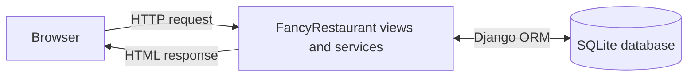

# Fancy Restaurant Reservation System

## Project Outline

Fancy Restaurant Reservation System is a web application that allows users to reserve a table at a restaurant.

Users can enter the number of guests, choose a desired date and time slot, and confirm a reservation. The system assigns a suitable available table based on the number of guests. If no table is available for the selected time slot, the system suggests another nearby time slot or another nearby date.

## Main User Actions

- The user can log in or enter their name.
- The user enters the number of guests.
- The user chooses a desired date from the calendar.
- The user chooses a desired time slot.
- The user confirms the booking with an OK button.
- The user can register as a user and log in.

## Main Data Entities

- Customer
- Table
- Reservation
- Time Slot

## Basic Data Model Idea

- Customers store a name, login name, and password value. Login processing is introduced in a later exercise.
- Tables have a table number and seating capacity.
- Time slots represent reusable reservation start times.
- Reservations connect one customer, reservation date, time slot, guest count, and assigned table.

The system should choose the smallest available table that can fit the number of guests.

Later exercises will add complete availability validation, cancellation handling, and nearby-slot suggestions.

## Initial Database Schema

The `reservations` app defines these Django models:

- `Customer`: the restaurant application's customer record, corresponding to `Patient` in the instructor's Dentistry example.
- `Table`: restaurant table records with a number and seating capacity.
- `TimeSlot`: reusable reservation start times such as `18:00` or `19:30`.
- `Reservation`: date-specific bookings connected to a customer, time slot, and assigned table.

Each model implements `__str__()` so records are readable in Django admin.

## Architecture Sketch



## Main User Flow

1. The user can log in or enter their name.
2. The user enters the number of guests.
3. The user selects a date.
4. The user selects a time slot.
5. The user pushes the OK button.
6. The system looks for an available table.
7. The system assigns a suitable table to the reservation.
8. The system shows a success message and reservation details.
9. If there is no available table for the selected time slot, the system suggests another nearby time slot or another nearby date.

## User Interface Notes

- The main screen shows a reservation form.
- The user enters the number of guests, selects a date and time slot, and presses the OK button.
- After the reservation is completed, the system shows the reservation details.
- If a reservation for the desired time slot is not possible, the system suggests the closest available time slot on the selected day or notifies the user that the day is fully booked.

## Current URL API

The current Exercise 6 views are intentionally simple function-based views. They return basic HTML with `HttpResponse`; the sample reservation POST action uses hard-coded values and redirects to a detail page.

| URL | View name | URL arguments | Request parameters | Return value | Purpose |
| --- | --- | --- | --- | --- | --- |
| `/` | `home` | none | none | `200 OK` HTML | Show the home page and links to basic actions. |
| `/tables/` | `table-list` | none | none | `200 OK` HTML | Show restaurant tables ordered by capacity and table number. |
| `/time-slots/` | `time-slot-list` | none | none | `200 OK` HTML | Show reservation time slots ordered by start time. |
| `/reservations/new/` | `reservation-form` | none | none | `200 OK` HTML | Show a placeholder reservation form page with current hard-coded sample values and a POST button. |
| `/reservations/sample-create/` | `reservation-sample-create` | none | none; current values are hard-coded | `302 Found` for an available table; `409 Conflict` when no suitable table or the sample time slot is unavailable; `405 Method Not Allowed` for `GET` | Create a sample reservation for Alice, 2 guests, 2026-08-01 at 18:00, then redirect to its detail page. |
| `/reservations/<reservation_id>/` | `reservation-detail` | integer `reservation_id` | none | `200 OK` HTML or `404 Not Found` | Show one reservation's customer, date, time, guest count, and table. |

Later exercises should replace the hard-coded sample action with real form input and complete availability logic.

## Development Environment

- Python 3.10.4
- uv
- Git
- GitHub

## Tools Used

- Black: code formatter
- Pylint: linter
- Pytest: testing framework
- Coverage.py: test coverage tool

## Setup

Install dependencies using uv.

```bash
uv sync
uv run python manage.py check
uv run python manage.py makemigrations reservations
uv run python manage.py migrate
uv run python manage.py test reservations
uv run pytest
```
